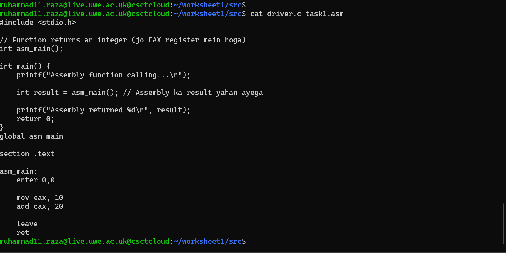
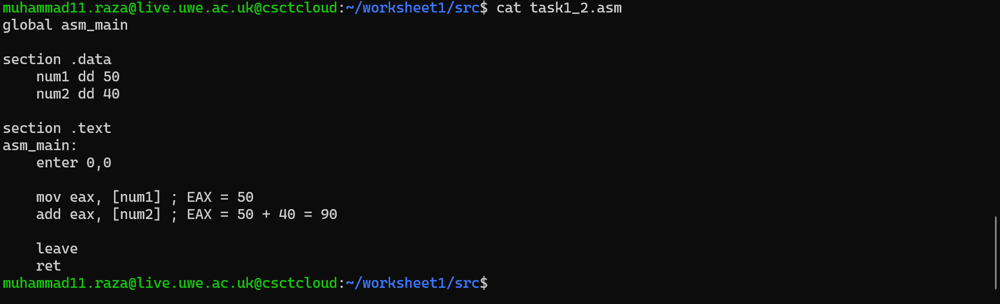
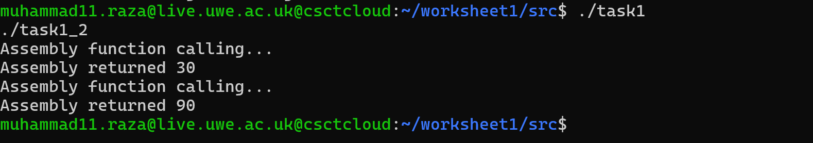
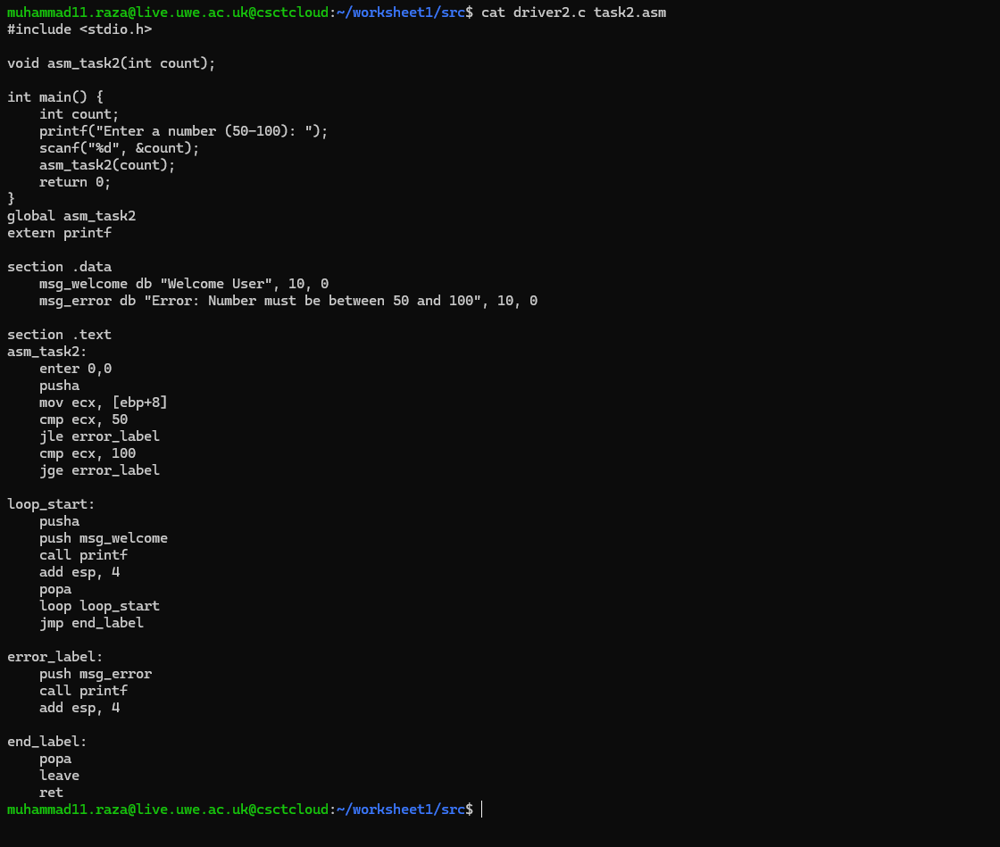
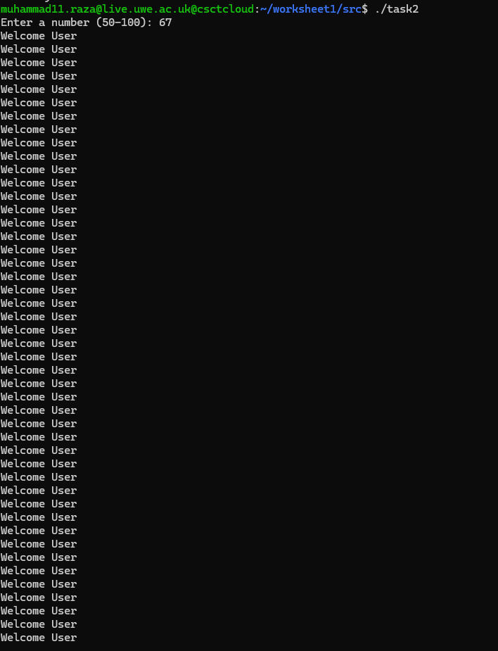
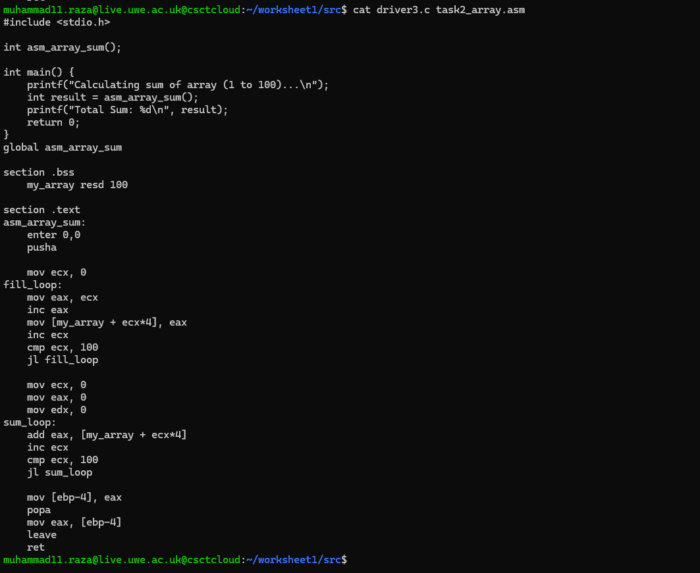
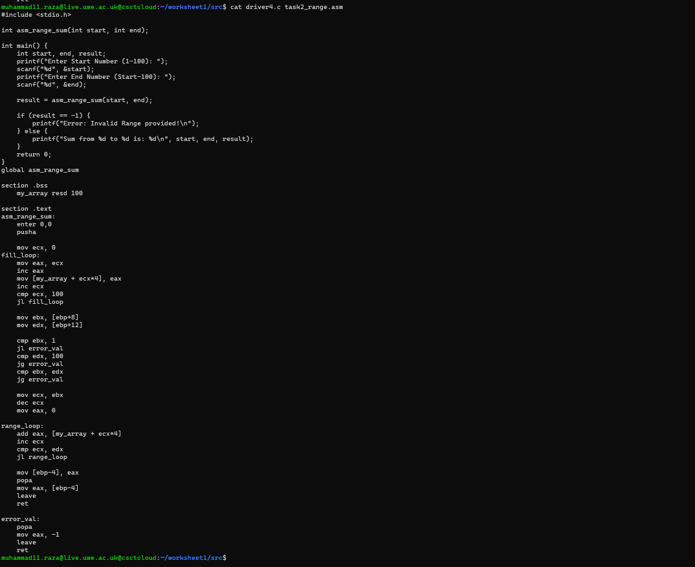
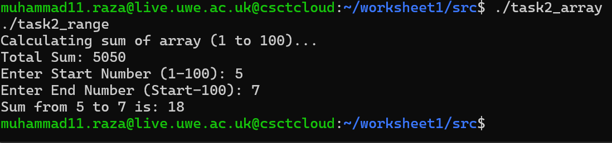
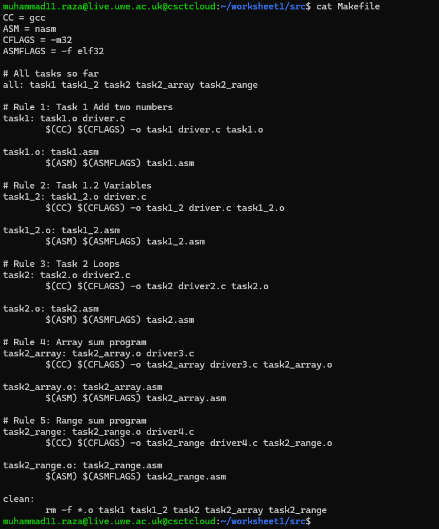
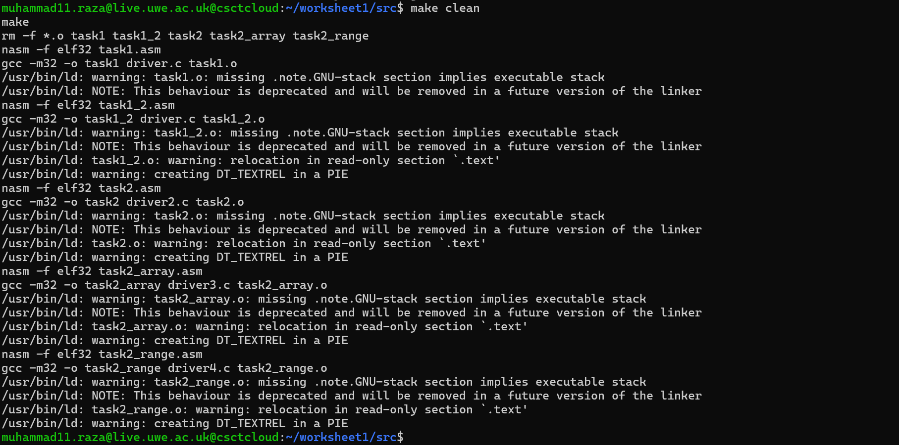

# Worksheet 1: An Echo of Assembler

This repository contains the solution for Worksheet 1 of the Operating Systems module. The goal was to implement basic assembly programs, link them with C drivers, and automate the build process using Makefiles.

## Project Structure
Here is an overview of all the source files and drivers created for this worksheet.

---

## Task 1: Basic Assembly Integration

**Description:** Created `asm_main` to add integers (10 + 20) and return the result to C. I also implemented a driver in C to interface with the assembly logic.

**Source Code:**
Below are the C driver and the Assembly implementation.

**My Understanding:**
I learned that C and Assembly can communicate directly. The C program calls the function defined in assembly, and the assembly function uses the EAX register to store the result, which is then returned to the C program. I also learned about preserving register states using pusha and popa.

**Task 1.2 Extension (Variables):**
For the extension, I modified the program to use variables from the `.data` section instead of hardcoded values.

**Task 1 & 1.2 Execution Output:**

*(Running ./task1 and ./task1_2)*

---

## Task 2: Loops and Conditionals

**Loop Program:** Prints "Welcome" loop based on user input (50-100).

**Source Code:**

**My Understanding:**
This task helped me understand control flow in assembly. Translating C loops (for/while) into Assembly required using comparison instructions (cmp) and jump instructions (jmp, jle, jge). I also implemented input validation to ensure the number provided by the user falls within the specific range.

**Task 2 Execution Output:**

*(Running ./task2)*

---

## Task 2 Extension: Arrays & Range Sum

**Description:**
1.  **Array Sum:** Calculates the sum of 100 integers (Result: 5050).
2.  **Range Sum:** Sums numbers within a specific range provided by the user.

**Source Code:**

**My Understanding:**
Memory addressing was the key concept here. Accessing array elements required calculating memory offsets (index multiplied by 4 bytes) because I was working with 32-bit integers. I initialized an array in the .bss section and iterated through memory to perform calculations.

**Range Sum Execution Output:**

*(Running ./task2_range)*

---

## Task 3: Build Automation (Makefile)

**Description:** Created a `Makefile` to compile all tasks with a single command.

**Source Code:**

**My Understanding:**
Typing long compilation commands repeatedly is inefficient. By using a Makefile, I automated the process of compiling C files with gcc and Assembly files with nasm. This ensures that all dependencies are linked correctly into the final executables.

**Build Process Output:**

*(Running make clean and make)*

---

## How to Run
1. Clone the repository.
2. Navigate to the src directory.
3. Run `make` to build all executables.
4. Run specific tasks: `./task1`, `./task2_range`, etc.
